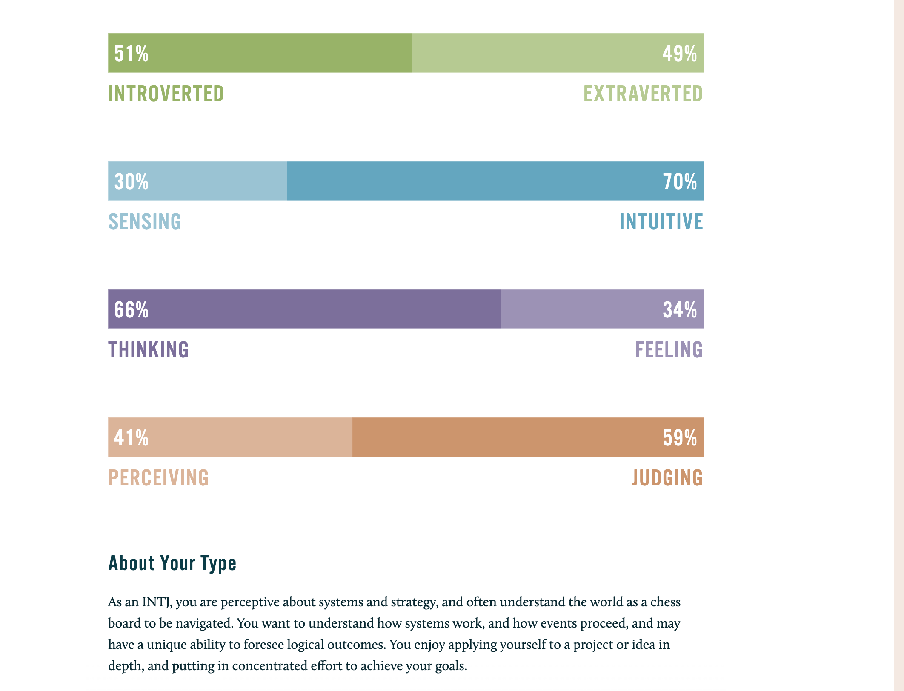

---
title: "Go INTJ: my MBTI type"
date: 2022-08-21
draft: false
tags: ["MBTI", "know thyself" ]
---

# Intro 

I've heard of MBTI for years and finally took the test in [16personalities](https://www.16personalities.com/) few months ago, I loved it. As always, I regret that I didn't start it earlier. 

I got my type identified as INTJ-A. The well-known people are "Little finger" in Game of Thrones, "Gandalf the Gray" in "The Lord of the Rings", Elon Musk, Friedrich Nietzsche etc. 

> As one of the rarest personality types – and one of the most capable – Architects (INTJs) know this all too well. Rational and quick-witted, Architects pride themselves on their ability to think for themselves, not to mention their uncanny knack for seeing right through phoniness and hypocrisy. But because their minds are never at rest, Architects may struggle to find people who can keep up with their nonstop analysis of everything around them.

I think this description resonates me pretty well overall, I even got a bit flattered by the characterization actually, but I'm not sure how much truth really in it, as I'm quite skeptical about online test. Out of curiosity, I joined an online MBTI meetup the other day, I was amazed by the enthusiasm of those members, and the endless analysis of the types and commonalities, and the abundant resources on internet. More importantly.  I was challenged that I might not be an INTJ, as the host put "some people might like the **identity of INTJ**, they would like to consider themselves as INTJ, but actually live in their own little "delusional bubble" and only surround themselves with people who validate them"  

Of course I don't buy it, so I'd like to dive deep and figure it out if I can. 

## I for Introverted, as it opposite to Extroverted  

There is no doubt that I'm introverted, I spend most of time alone everyday, I need way more time alone than most people. Most of the social activities isn't my thing. I value peace of mind than exciting activities. 
Though I'm a team player, I do like to work with people or talk with people/topics I genuinely interested about, I could be acting like an extrovert time to time, but overall, there shouldn't be question about it. 

## N for Intuition, as opposed to Sensory   

> This kind of person are drawn into abstraction, something like process, optimization, summary etc. 

I've always known myself not very grounded. In general, I'm quite chill with most sensual stuff like food, clothes, appearance, even fun activities. Instead, I'm quite interested in something like the meaning of life, nutrition, psychology, business and power.    

The podcast from Wall street Journal I've been listening for 5+ years, each episode it starts with saying "A podcast about money, business and power", it resonates me so well. 
[podcast](https://www.wsj.com/podcasts/the-journal?mod=podcasts_tile)

### ephemeral vs ever-lasting  

I have very little interest in trivial things (don't mean they're not important), or some sensory pleasure. For example, I'm quite easygoing with food, lots of people around me (most from Asia) having issue with American/western food, or they crave for Asian food, I'm an outlier. I'm pretty chill with whatever decent food I could get, I'm not eager to get better tasty food if not necessary.
Don't get me wrong, I do appreciate tasty food, I do like Asian food way more than western food in general, but just my motivation & cravings are quite weak, I don't need them very often.  

Instead I care way more in the healthy & nutrient side of the food, how my body likes them (besides of taste buds), how could I train my body to adopt the "right diet".  How could I make it more efficient as money/time/energy wise, as I need to cook everyday under the forever pandemic. The same pattern in me applies to clothing, travel, entertainment etc. I'm not in the consumerism trap. 

### Abstraction  

My interest area is quite broad and strong, most are far-fetched ideas, as opposed to "down to the earth". I'm passionate about crypto/blockchain, finance, psychology, economy and politics etc, I talk loud and nonstop when topics fall into those area and I often don't notice myself.

I don't usually take things as their face value, especially when things surprised me, I'd ask a lot of "Why", then I'd let it go and try not let it happen again. 

Lots of things I do not only for the result, but during the process how it trains me regarding skills, mentality etc, and the expected/unexpected consequence associated. For example, one of my favorite, stock market investing. Of course I'd hope to make money in the end, but for the day to day operations, I treat it as a training. Filtering the enormous of financial data and analysis, taming my fear & greed mentality during different situations, learn and observe how the society, business and economy work, and inevitable it gets into politics and government policies. And most importantly for me, stock market & economy, they're not hard science, which means there always lots of different answers and predictions, this makes it so interesting to me.   

fascinate by the idea, not to help with anything. 
talk about idea just for the idea

## T for Thinking, as it opposes to Feeling  

For people like me who grew up with Asian culture, it's very naturally to not be a "feeler". We were told million times that we're not good enough, not talented, not privileged, will not be liked if we don't follow the beaten path(golden path). There is a very classic word in China (and East Asia) called "忍", it literally means forbearance. Lots of people putting the enlarged character on the wall for inspiration and reminding. 

Especially for males, but I believe it's quite similar in Western culture, males are not encouraged to show emotions or vulnerabilities, which could also causes lots of issue. 

But genuinely I do value thinking way over feeling, I've always want to be tough and determined, working as efficiently as a machine, feelings has always been something extra for me. They're good to have, but not essential.

<!-- If I want to do something, I need to know the reasons and motives, simply and clearly, I like things being simple, feelings are too complicated to me to figure out. --> 

<!-- People around me probably know me that I'm usually quite calm, level-headed and lightly carefree. I've worked very hard on that, especially after I studied stoicism ( it is another topic I'll share in another post). I aspire to be a stoic, who could detach themselves with things are not under their control, and be -->     

Looking back of my own life stories, I had few breakouts with people and made a handful of decisions that I really regret, I often think about them and hope I could be more rational. 

There are few times, friends(very closed) called me out that I ignored their feelings, most of times I didn't really feel that, either consciously or unconsciously.

I'm also a fan of Stoicism, one things I learned from it is not only letting go feeling / emotions, but deliberately practice those tough/exuberant things and train your mind to watch and tame it.  

I've been a big fan of stoicism, the essence of stoicism is let go of ego, emotions, like a cow staying there and being indifferent of all weather. Threat all unexpected, setbacks as expected, even train yourself to get over the emotions, emotions are natural burden, we get way more free when we don't get attached with them.   

Lack of creativity 

I've been trying to disassociate my own feeling/energy/motivation with anything in my face, instead I've been trying to setup a system that feedback my energy/interest selectively. 
for example, I try to be active, proactive, encourage in the work environment, I won't get discouraged by inactive response, that's just my preferred style, of course I won't be pushy(might be preachy). 

### J for Judging, as opposed to perceiving   

I'm not sure `Judging` and `Perceiving` are the best words for describing these two personalities. Judge is an sensible word, I rarely judge others (at least publicly or overtly), I do judge myself a lot, and I'm quite opinionated on things I care. 

I like things in order, abstract things instead of physical, I can't say my physical belongingness are very organized. But for my career, investing, my routine(eating, sleeping, workout), I do pay a lot of attention and I spent lot of time optimizing and making sure they're on the right trajectory.    

I rarely being spontaneous, and I don't like myself being that most of time, I enjoy living in sober and level-headed, I treat everything as an investment, and I aspire to engineer my life and life events as much as I can. It might sound cold, but radical rationality is cold (Though I think I'm a warm person). 

# In the end 

## Resources 
I watched [This video](https://www.youtube.com/watch?v=mKKzX-D2-GM) back and forth multiple times, I really appreciate his insights, I can try to regurgitate his ideas and try apply them in my life. 

